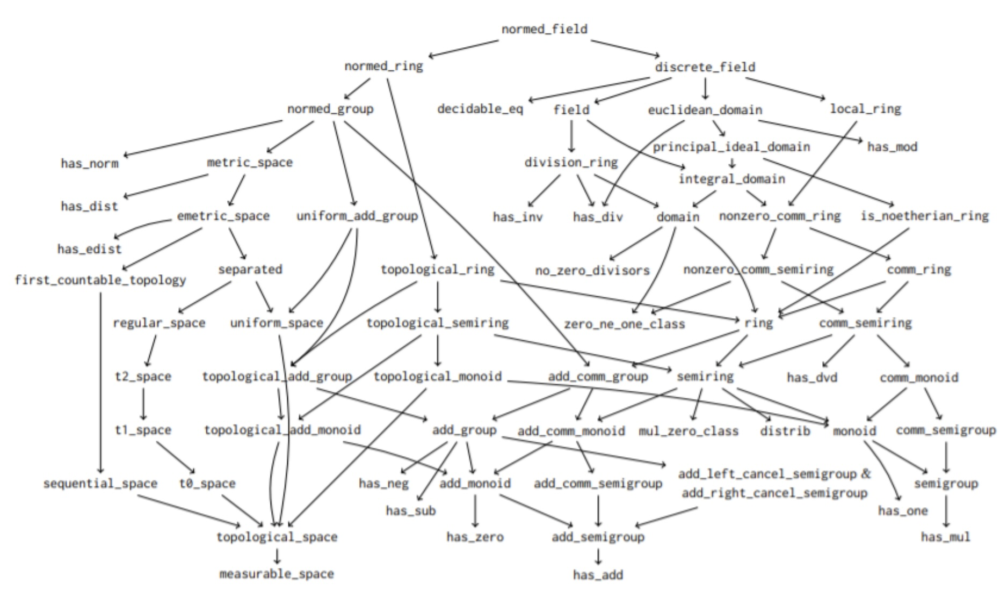

<center><h1>EE 546 : Automated Reasoning</h1></center>
<center><h2>HIERARCHIES</h2></center>

<center>
Department of Electrical and Computer Engineering<br />
Unviersity of Washington<br />
Prof. Eric Klavins<br />
Winter 2025<br />
Solutions: H2Solve.lean
</center>
<br />


```hs
import Mathlib.LinearAlgebra.Matrix.Determinant.Basic
import Mathlib.Tactic
import Mathlib.Algebra.Group.MinimalAxioms
import Mathlib.Data.Complex.Basic

import EE546_W25.Lib.ComplexSimps  -- My own libraries
import EE546_W25.Lib.UHP

open Complex
```
 # Documentation Maker

This file can be converted into viewable Markdown by using a new script:

```bash
cd EE546_W25/docmaker/dm.py
python dm.py ../EE546_W25/Lectures/SL2.lean > SL2.md
```

You can then view the file either directly in VSCode using Cmd-V or in your favorite Markdown viewer. I like [this one](https://chromewebstore.google.com/detail/markdown-viewer/ckkdlimhmcjmikdlpkmbgfkaikojcbjk?hl=en&pli=1).

Note that you can use Latex and it will render in the Markdown Viewer:

$$
\sum_{n=0}^\infty r^n = \frac{1}{1-r}.
$$

More sophisticated converters can be used as well. Lean uses `DocGen`, but it seems to want to build your entire project including all the dependencies. The various books like MIL and TIL seem to use Sphinx, which seemed like overkill for the present purposes.

For your final project, you will need to use this script (or figure out how to use one of the other ones) to generate a nicely written up report.


 # Code structure

  * SL2.lean : This file
    * Lots of documentation!
  * Lib/ComplexSimps.lean : A lot of obvious things about complex numbers
  * Lib/UHP.lean : Definitions for the upper half plane of the complex numbers


# Some of Mathlib's Classes



## Relationships between types

In some ways, mathematics is about data structures, their properties, and their relationships to each other. One relationship we have encountered is "constructed from". For example, ℤ is constructed from ℕ and ℚ is constructed from ℤ.

Another relationship is "is a specialization of". For example,

  * Matrices that commute are a specialization of all matrices.
  * The type of matricies of determinant one is a specialization of all matrices.
  * The type of complex numbers with positive imaginary part is a specialization of complex numbers.

## Relationships between classes

In Lean, a `class` is a group of types that all share the same constraints. An `instance` of a class is a statement that particular type has the constraints required by the class. For example:

  * The set of non-negative integers instantiates the class `Add`, because the sum of any two non-negative integers is also non-negative.
  * The set of matricies with non-zero determinant instantiates the class `Inv`, because the inverse of such a matrix is invertable.

Specialization lifts to classes as well. For example:

  * The class `AddSemiGroup` specializes the class `Add`, requiring that addition is associatve. In fact, you can not even describe associativity without first having a operation `+` to associate.

To say this in Lean, you use `extend`: 
```hs
class AddSemigroup' (G : Type*) extends Add G where
  add_assoc : ∀ a b c : G, a + b + c = a + (b + c)
```
 To instantiate this class, you have to start with a type that has already instantiated `Add`. 
 ## Example types used in this chapter

  In this document we introduce three new types:

  * `UHP`: Complex numbers with positive imaginary part

  * `SL2`: 2x2 integer matrices with determinant 1

  * `FLT`: Functions of the form $z \mapsto \frac{az+b}{cz+d}$ for $z$ : UHP

We will see that SL2 and UHP both form a `Group`, which means they have:

  * An associative multiplication operation
  * A multiplicative indentity element
  * Inverses

UHP, on the other hand, just instantes `Add`. Other properties, like multiplication, are not preserved by UHP. 
 ## Avoid Sets

One way to define all of these data types would be to use and subsets. For example: 
```hs
namespace Avoid

def UHP : Set ℂ := { z | z.im > 0 }
```
 But that runs into problems. With this definition, UHP has type Set ℂ. It is not a type in and of itself. 
```hs
variable (z : UHP)
#check z  -- @Set.Elem ℂ UHP

end Avoid
```
 And since it is not a type, you cannot use the class/instance infrastcture Lean has for types. 
 ## The L∀∃N Way: Use Types

Lean is based on type theory! Let's use it! This approach packages values and properties into a core Lean data type that works with classes and instances.

As an aside, the @[ext] modifier lets you use the `ext` tactic, which states that two structures are equal if their fields are equal. And the `by decide` bit is a default proof for very simple elements of UHP. 
```hs
namespace Temp

@[ext]
structure UHP where
  z : ℂ
  pos_im : z.im > 0 := by decide
```
 With this in place, we can define new elements of UHP and operations on them. For example, below we define the imaginary number $j$ and addition on UHP. Note that for addition to work, we have to show that the sum of two complex numbers with non-negative imaginary parts in also imaginary. 
```hs
def j : UHP := ⟨ I, by simp ⟩

def uhp_add (x y: UHP) : UHP :=
  ⟨
    x.z + y.z,
    im_gt_to_sum_gt x.pos_im y.pos_im
  ⟩

example : uhp_add j j = ⟨ 2*I, by simp ⟩ := by
  simp[uhp_add,j]
  ring
```
 ## Interfacing with classes

As described above, a *class* in Lean is a way to define an interface between new data types and the methods that operate on them. And example class is `Add` which is defined as follows: 
```hs
class Add' (α : Type*) where
  add : α → α → α
```
 This class can be instantiated by anything that has some kind of addition. Then you can use all the infrastructure Lean has for addition, including the + notation.

Here is how you do that for our new type `UHP`. Note that we also have to instantiate HAdd (which stands for Heterogeneous Add). 
```hs
#check_failure j + j

@[simp]
instance uhp_hadd_inst : HAdd UHP UHP UHP :=
  ⟨ uhp_add ⟩

@[simp]
instance uhp_add_inst : Add UHP :=
  ⟨ uhp_add ⟩

#check j + j
```
 ## Using classes in definitions and theorems

As we encountered when discussing sums, we can define our own sum method. It would be very nice to be able to use it on any type that instantiates `Add`. It turns out this is easily done as follows using square braces. 
```hs
def sum {α : Type*} [Add α] [Zero α] (f : ℕ → α) (n:ℕ) : α
  := match n with
  | Nat.zero => 0
  | Nat.succ k => f k + sum f k

#eval sum (λ i : ℕ => i) 10

def M : Matrix (Fin 2) (Fin 2) ℕ := !![1,0;0,1]

#eval sum (λ _ => M) 3
```
 (The above definition does not work with UHP, however, since it expects the type `α` to have a defined `Zero` element, and UHP doesn't have zero.) 
 ## Other basic classes

There are not many other classes that `UHP` works well with. But some that are nice to instantiate are

  * `CoeSort`, which allows you to write x instead of x.z when the type checker expects the underlying value type, in this case as a Complex number.
  * `Inhabited`, showing the UHP has a least one thing in it.

We can also define some niceties to make UHPs easier to read. 
```hs
instance uhp_coe_inst: CoeSort UHP ℂ := ⟨ λ u => u.z ⟩
instance uhp_inhabited_inst : Inhabited UHP := ⟨ j ⟩

abbrev UHP.re (x:UHP) := x.z.re
abbrev UHP.im (x:UHP) := x.z.im
def UHP.conj (z:UHP) : ℂ := z.re - z.im * I
```
 ### Exercise

A nontrivial type has at least two elements. A class noting this is declared like this: 
```hs
class Nontrivial' (α : Type*) : Prop where
   exists_pair_ne : ∃ x y : α, x ≠ y
```
 Here is an example for you to try. 
```hs
instance uhp_non_triv : Nontrivial UHP :=
  ⟨ sorry ⟩

end Temp
```
 # Extended Example: The Special Linear Group, SL2

Consider the 2x2 matrices with Integer entries of the form

  $$
  \begin{pmatrix}
  a & b\\
  c & d
  \end{pmatrix}\;\;\;\mathrm{where}\;ad - bc = 1
  $$

That is, the determinant of the matrix is 1. These matrices form a group called the Special Linear Group SL(2,ℤ), which we want to teach Lean about. First we define a structure to hold the value and a proof the value has determinant 1. 
```hs
@[ext]
structure SL2 where
  val : Matrix (Fin 2) (Fin 2) ℤ
  det1 : val.det = 1 := by decide

#check SL2.ext
#check SL2.ext_iff
```
 ## Elements of SL2

Each element has a matrix value and a proof that the value has determinant one. These can be written in a variety of ways.
```hs
-- use default constructor
#check SL2.mk !![1,1;0,1] rfl
#check ({val:=!![1,1;0,1], det1 := rfl} : SL2)

-- use default constructor with default proof for det1
#check SL2.mk !![1,1;0,1]
#check ({val:=!![1,1;0,1]} : SL2)

#check (⟨!![1,1;0,1], rfl⟩ : SL2)

#check_failure SL2.mk !![1,1;1,1]
```
 Two distinguished elements in SL2 are the following matrices:

  $$
  T = \begin{pmatrix}
  1 & 1\\
  1 & 0
  \end{pmatrix} \; \; \mathrm{and} \; \;
  W = \begin{pmatrix}
  0 & -1\\
  1 & 0
  \end{pmatrix}
  $$

These elements are said to *generate* SL2, because every element of SL2 can be formed from a combination of $T$, $S$ and their inverses (although we will not prove that in this chapter). 
```hs
def T := SL2.mk !![1,1;0,1]
def S := SL2.mk !![0, -1; 1, 0]
```
 ## Classes and Instances

We would like to use all the notation and theorems associated with groups without reproving everything. To that end, we will use the following classes:

| Class | Meaning |
| --- | --- |
| `Inhabited`   | SL2 has at least one element |
| `CoeSort`     | Write A instead of A.val when context is clear |
| `HMul`, `Mul` | SL2 has multiplication |
| `Inv`         | SL2 has inverses |
| `One`         | SL2 has an identity |
| `SemiGroup`   | SL2 multiplication is associative |
| `MulOneClass` | $1A = A$ |
| `Group`       | $A⁻¹A = 1$ and $AA⁻¹ = 1$ |


 To get started, we can show that SL2 is inhabited by assigned a default element, in this case, the identity matrix. 
```hs
instance mod_inhabited_inst : Inhabited SL2 := ⟨ SL2.mk !![1,0;0,1] ⟩

def SL2.default : SL2 := Inhabited.default
```
 ## Coercion

When we have M : SL2, we would like use M as a matrix. But we end up having to write M.val in such contexts. For example, in the first attempt at definition multiplicaton below, the first argument to the constructor expects a matrix. In the second, we use the matrix as a function. 
```hs
def sl2_mul' (A B : SL2) : SL2 := ⟨ A.val * B.val, by simp[A.det1,B.det1] ⟩

def f' (A:SL2) (i: Fin 2) : ℤ := A.val i i
```
 To make our code more readable, we can provide a coercion from SL2 into a Matrix or a function. 
```hs
instance mod_group_coe: CoeSort SL2 (Matrix (Fin 2) (Fin 2) ℤ) :=
  ⟨ λ M => M.val ⟩

instance mod_group_coe_fun: CoeFun SL2 (λ _ => (Fin 2) → (Fin 2) → ℤ) :=
  ⟨ λ M => (λ i j => M.val i j) ⟩
```
 Now the above definition can be writte a bit more concisely. 
```hs
def sl2_mul (A B : SL2) : SL2 := ⟨ A * B, by simp[A.det1,B.det1] ⟩

def f (A:SL2) (i: Fin 2) : ℤ := A i i
```
 ## Multiplication

To interface with classes that require multiplication, we instantiate both `Mul` and `HMul`, allowing us to use the `*` notation and to build other instances that extend these classes.

```hs
#check_failure S*T

instance sl2_hmul_inst: HMul SL2 SL2 SL2 :=
  ⟨ sl2_mul ⟩

instance sl2_mul_inst: Mul SL2 :=
  ⟨ sl2_mul ⟩

#check S*T
#eval S*T
```
 It is also quite useful to tell the simplifier what multiplication means, so that you don't have to constantly be breaking this definition down inside proofs. 
```hs
@[simp]
theorem sl2_mul_simp (A B : SL2) : A * B = ⟨ A*B, by simp[A.det1,B.det1] ⟩ := by
  calc A * B
  _  = ⟨ A, A.det1 ⟩ * ⟨ B, B.det1 ⟩ := rfl
  _  = ⟨ A*B, by simp[A.det1,B.det1] ⟩ := rfl --!hide
```
 While we are at it, we can do the same for UHP: 
```hs
@[simp]
theorem uhp_add_simp (x y : UHP) : x + y = ⟨ x + y, by exact Right.add_pos' x.pos_im y.pos_im ⟩ := by
  simp[uhp_add]
```
 ### Exercise

Here is an example problem to try to prove that uses these definitions. 
```hs
example : ¬ ∀ A B : SL2, A*B = B*A := sorry
```
 ## Inverses

Next we show that the inverse of every element of type SL2 is also of type SL2. This is because the determinant of the inverse of a matrix is the inverse of its determinant, and SL2 determinants are all 1. 
```hs
#check_failure T⁻¹

noncomputable                             -- noncomputable because this method does
instance sl2_inv_inst: Inv SL2 :=         -- not show how to derive the inverse, just
  ⟨ λ M => ⟨ M⁻¹, by simp[M.det1] ⟩  ⟩    -- that it exists since M.det = 1.

#check T⁻¹

@[simp]
theorem sl2_inv_simp (A : SL2) : A⁻¹ = ⟨ A⁻¹, by simp[A.det1] ⟩ := rfl
```
 Recall that the inverse of a matrix $A$ , when it exists, is $|A|^{-1}$ times the adjunct of $A$. Since SL2 determinants are all 1, we can show that the inverse of a matrix of type SL2 is equal to its adjunct.

First we define the adjunct of a matrix. 
```hs
def adj (A : SL2) : SL2 := ⟨ !![A 1 1, -A 0 1; -A 1 0, A 0 0 ], by
  dsimp
  have h := A.det1
  simp_all[Matrix.det_fin_two]
  rw[←h]
  ring ⟩
```
 Then we state and prove our first theorem. 
```hs
theorem sl2_inv_simp_eq_adj (A : SL2) : A⁻¹ = adj A := by
  simp[adj,sl2_inv_inst]
  simp[Matrix.inv]
  have h : A.val.det = 1 := by apply A.det1
  simp[h]
  simp[Matrix.adjugate_fin_two]
```
 ### Exercise

Here is an example that uses all these definitions and theorems. 
```hs
example : ∀ A B : SL2, (A*B)⁻¹ = B⁻¹ * A⁻¹ := sorry
```
 ## The Identity

As it stands, although SL2 has the same identity as matricies in general, Lean doesnot' know about it. So we can't use notation like $1$ and we can't build more instances that expect a 1inst_. But all we need to do is intantiate `One`. 
```hs
@[simp]
def one : SL2 := ⟨ 1, by simp ⟩

#check_failure T * 1

instance sl2_one_inst: One SL2 := ⟨ one ⟩

#check T * 1
```
 It also helps to explain to the simplifier how one works.  
```hs
@[simp]
theorem sl2_one_simp : (1:SL2) = one := rfl

@[simp]
theorem sl2_one_simp_expl : (1:SL2) = ⟨ !![(1:ℤ),0;0,1], by simp ⟩ := by
  simp[one]
  exact Matrix.one_fin_two

theorem sl2_one_simp_expl' : (1:SL2) = !![(1:ℤ),0;0,1] := by
  simp[one]
  exact Matrix.one_fin_two
```
 ### Exercise

Here is a simple theorem in which all you really need to do is unpack the definition of SL2. Hint: use `Matrix.nonsing_inv_mul`.
```hs
example : ∀ A : SL2, A⁻¹*A = 1 := sorry
```
 ## Associativity

As described above, a `Semigroup` is a type that has an operation (in this case `*`) that is associative. To register this property with Lean we instantite this class as follows. 
```hs
@[simp]
theorem sl2_mul_assoc : ∀ A B C : SL2 , A * B * C = A * ( B * C ) := by
  intro A B C
  simp[Matrix.mul_assoc]

instance inst_mod_semi: Semigroup SL2 :=
  ⟨ sl2_mul_assoc ⟩
```
 ## The Identity is well behaved

Next we prove that `1` behaves like a multiplicative inverse. 
```hs
@[simp]
theorem sl2_one_simp_left : ∀ A : SL2, 1 * A = A := by
  intro A
  simp

@[simp]
theorem sl2_one_simp_right : ∀ A : SL2, A * 1 = A := by
  intro A
  simp

instance inst_mul_one : MulOneClass SL2 :=
  ⟨ sl2_one_simp_left, sl2_one_simp_right ⟩
```
### Exercise
Show that SL2 is not commutative in general. So you could not instantiate `CommGroup`, for example. 
```hs
#eval S*T
#eval T*S

example : S*T ≠ T*S := sorry
```
 ## Inverse theorems and Group

Finally, we show that SL2 forms a group. The last ingredient is to show that inverses are well behaved.  
```hs
@[simp]
theorem sl2_inv_simp_left : ∀ A : SL2, A⁻¹ * A = 1 := by
  intro A
  simp[A.det1]

@[simp]
theorem sl2_inv_simp_right : ∀ A : SL2, A * A⁻¹ = 1 := by
  intro A
  simp[A.det1]
```
 The group instance is then formed as follows. Note that the `Group` class lists a lot of redundant properties. The helper method `Group.ofLeftAxioms` allows use to just use the minimal set of properties and it derives the rest for us. 
```hs
noncomputable
instance inst_mod_group : Group SL2 :=
  @Group.ofLeftAxioms SL2 _ _ _ sl2_mul_assoc sl2_one_simp_left sl2_inv_simp_left
```
 ### Example Calculation

Now we can use Mathlibs built in simplification rules for groups either directly, or by just calling the `group` tactic. 
```hs
example (A B : SL2): (A⁻¹*B*A)⁻¹ = A⁻¹*B⁻¹*A :=
  calc (A⁻¹*B*A)⁻¹
  _  = A⁻¹ * (A⁻¹*B)⁻¹   := by rw[DivisionMonoid.mul_inv_rev]
  _  = A⁻¹ * (B⁻¹*A⁻¹⁻¹) := by rw[DivisionMonoid.mul_inv_rev]
  _  = A⁻¹ * (B⁻¹*A)     := by rw[DivisionMonoid.inv_inv]
  _  = A⁻¹ * B⁻¹ * A     := by rw[Semigroup.mul_assoc]

example (A B : SL2): (A⁻¹*B*A)⁻¹ = A⁻¹*B⁻¹*A := by group
```
 ### Exercise 
```hs
example (A B C : SL2) : A * (B * C) * (A * C)⁻¹ * (A * B * A⁻¹)⁻¹ = 1 := by sorry
```
 # Fractional Linear Transformations

A 2x2, integer fractional linear transformation with determinant 1, or FLT (for short), is a map on the UHP half of the complex plane of the form:

   $$
    z \mapsto \frac{az+b}{cz+d}
   $$

where a*c - b*d ≠ 0. If, in addition,

  * a, b, c and d are integers and
  * a*c - b*d = 1

then we obtain a different representation of the modular group with function composition as the group operation. We'll build up that data structure here, and show the isomorphism. 
 ## An FLT class 
```hs
@[ext]
structure FLT where                        -- TODO: a general FLT class would
  a : ℤ                                    -- have any Ring as the type of of
  b : ℤ                                    -- a, b, c and d and would only
  c : ℤ                                    -- require a nonzero determinant.
  d : ℤ
  det1 : a*d - b*c = 1 := by decide
```
 ## First Goal : FLT's preserve UHP

Our first goal is to define the map $z \mapsto (az+b)/(cz+d)$ and show it takes $z:UHP$ to $z:UHP$. A proof of this statement can be found [here](https://public.websites.umich.edu/~hlm/nzm/modgp.pdf). The proof is basically algebra, but there are a number of steps that a computer needs to understand before you can just crank through the equations.

To proceed, we need some helper theorems. This first one shows that if $z ≠ 0$ then the denominator $cz+d$ is also not equal to zero, which is required to even define the entire map. We will need this theorem in two different places in the ultimate proof. 
```hs
theorem den_nz (f : FLT) (z: ℂ) : z.im ≠ 0 → f.c * z + f.d ≠ 0 := by

  match f with
  | ⟨ a,b,c,d, hdet ⟩ =>
  match z with
  | ⟨ x, y ⟩  =>

  intro hz h
  simp at h hz
  obtain ⟨ h1, h2 ⟩ := h

  cases h2

  case inl hc0 =>
    have hd : d = 0 := by simp_all[hc0]
    have : a * d - b * c = 0 := by simp[hc0,hd]
    simp[this] at hdet

  case inr hy0 => exact hz hy0
```
 Now we define the map and include the associated proof that the map indeed goes from UHP to UHP.

***TODO***: Make this proof *much* simpler by factoring out more lemmas about Complex and UHP.


```hs
noncomputable
def fl_map (f : FLT) (z : UHP) : UHP := ⟨ (f.a*z + f.b)/(f.c*z + f.d), by

    have hz  := den_nz f z (uhp_im_nz z)
    have hzc := den_nz f z.conj (uhp_conj_im_nz z)

    match f with
    | ⟨ a,b,c,d,hdet ⟩ =>
    match z with
    | ⟨ z, hpos ⟩ =>
    simp
    simp only [intCast_re, intCast_im,uhp_conj_simp] at hz hzc

    let q := (c * z.conj + d)

    have h1 : q ≠ 0 → q / q = 1 := by
      intro h
      field_simp

    have h2 : q ≠ 0 := by  exact hzc

    have h3 : q/q = 1 := h1 h2

    have h4 : (a * z + b)/(c * z + d)
            = (c*z.conj + d)*(a * z + b) / ((c*z.conj + d)*(c * z + d)) := by
      calc (a * z + b)/(c * z + d)
      _  = (a * z + b)/(c * z + d):= by simp
      _  = ((c*z.conj + d)/(c*z.conj + d))*(a * z + b)/(c * z + d) := by simp[h3,q]
      _  = (c*z.conj + d)*(a * z + b) / ((c*z.conj + d)*(c * z + d)) := by simp

    rw[h4,mul_by_conj_plus,split_helper]

    have h5 : (a:Complex)*d - b*c = 1 := by
      rw[lift_both_sides] at hdet
      simp at hdet
      exact hdet

    simp[h5]

    have hc0_to_d : c = 0 → d ≠ 0 := by
      intro hc0
      simp[hc0] at hdet
      exact right_ne_zero_of_mul_eq_one hdet

    have hznz : z.im ≠ 0 := by exact Ne.symm (ne_of_lt hpos)

    apply im_of_frac2
    . simp[im_of_sum]
      simp[im_zero_of_sq]
    . simp[re_of_sq]
      by_cases hc : c = 0
      . simp[hc]
        exact hc0_to_d hc
      . have h1 : ↑c * z.im * (↑c * z.im) > 0 := by
          simp[simp]
          exact ⟨ hc, λ hzi => by exact hznz hzi ⟩
        have h2 : (↑c * z.re + ↑d) * (↑c * z.re + ↑d) ≥ 0 := by
          exact mul_self_nonneg (↑c * z.re + ↑d)
        exact add_pos_of_nonneg_of_pos h2 h1
    . simp[im_of_sum]
      simp[z_norm_im_zero]
      exact hpos

⟩
```
 Here is an example showing the use of the map. Note that it would throw a type error if the output of fl_map were not in UHP. So this short statement actually packs a lot of information into it. 
```hs
#check (fl_map ⟨1, 1, 0, 1, rfl ⟩) ⟨ 2 + I, by simp ⟩
```
 ## FLT is a group

Now we can start proving FLT is a group!

 
```hs
noncomputable
instance fl_coe_fun: CoeFun FLT (λ _ => UHP → UHP) :=
  ⟨ λ f => (λ z => fl_map f z) ⟩

def fl_to_sl2 (f : FLT) : SL2
  := ⟨ !![f.a,f.b;f.c,f.d], by simp[f.det1] ⟩

def sl2_to_fl (A : SL2) : FLT
  := ⟨ A 0 0, A 0 1, A 1 0, A 1 1, by
    have h := A.det1
    simp[Matrix.det_fin_two] at h
    exact h⟩

theorem sl2_map_map : sl2_to_fl ∘ fl_to_sl2 = id := by
  funext
  simp[fl_to_sl2,sl2_to_fl]

theorem fl_map_map : fl_to_sl2 ∘ sl2_to_fl = id := by
  funext A
  simp[fl_to_sl2,sl2_to_fl,SL2]
  ext i j
  fin_cases i <;> fin_cases j <;> simp

theorem sl2_eq_imp_fl_eq (f g : FLT): fl_to_sl2 f = fl_to_sl2 g → f = g := by
  intro h
  simp[fl_to_sl2] at h
  apply Matrix.ext_iff.mpr at h
  ext
  . apply h 0 0
  . apply h 0 1
  . apply h 1 0
  . apply h 1 1

theorem fl_eq_imp_sl2_eq (f g : FLT): f = g → fl_to_sl2 f = fl_to_sl2 g := by
  intro hfg
  apply FLT.ext_iff.mp at hfg
  obtain ⟨ ha, hb, hc, hd ⟩ := hfg
  simp[fl_to_sl2,ha,hb,hc,hd]

def fl_comp (f g : FLT) : FLT :=
  let A := fl_to_sl2 f
  let B := fl_to_sl2 g
  let AB := A*B
  ⟨ AB 0 0, AB 0 1, AB 1 0, AB 1 1, by
    have h := AB.det1
    simp[Matrix.det_fin_two] at h
    exact h ⟩

noncomputable
def fl_inv (f : FLT) : FLT :=
  sl2_to_fl ( (fl_to_sl2 f)⁻¹)

-- just checking whether coercion works
example (f: FLT) (z : UHP) : f z = f z := rfl

instance fl_inhabited : Inhabited FLT := ⟨ ⟨ 1,0,0,1,rfl ⟩ ⟩

instance fl_hmul_inst : HMul FLT FLT FLT := ⟨ fl_comp ⟩

instance fl_mul_inst : Mul FLT := ⟨ fl_comp ⟩

noncomputable
instance fl_inv_inst : Inv FLT := ⟨ fl_inv ⟩

def fl_one : FLT := ⟨ 1, 0, 0, 1, rfl ⟩

instance fl_one_inst : One FLT := ⟨ fl_one ⟩

theorem fl_comp_sl2 (f g : FLT)
  : fl_to_sl2 (f*g) = (fl_to_sl2 f) * (fl_to_sl2 g) := by
    simp[fl_to_sl2,fl_hmul_inst,fl_comp]

theorem fl_comp_sl2_iff (f g h: FLT)
  : h = f * g ↔ (fl_to_sl2 h) = (fl_to_sl2 f) * (fl_to_sl2 g) := by
  apply Iff.intro
  . intro h1
    simp_all[fl_to_sl2,fl_hmul_inst,fl_comp]
  . intro h2
    rw[←fl_comp_sl2] at h2
    apply sl2_eq_imp_fl_eq at h2
    exact h2

theorem fl_mul_assoc : ∀ f g h : FLT, f * g * h = f * (g * h) := by
  intro f g h
  simp[fl_comp_sl2_iff,fl_to_sl2,fl_hmul_inst,fl_comp]
  exact ⟨ by ring, by ring, by ring, by ring ⟩

instance fl_semi_inst: Semigroup FLT :=
  ⟨ fl_mul_assoc ⟩

theorem fl_mul_one_left (f : FLT) : 1 * f = f := by
  have : 1 = fl_one := rfl
  rw[this]
  simp[fl_hmul_inst,fl_to_sl2,fl_comp,fl_one]

theorem fl_mul_one_right (f : FLT) : f * 1= f := by
  have : 1 = fl_one := rfl
  rw[this]
  simp[fl_hmul_inst,fl_to_sl2,fl_comp,fl_one]

instance fl_mul_one_inst : MulOneClass FLT :=
  ⟨ fl_mul_one_left, fl_mul_one_right ⟩

def fl_adj (f : FLT) : FLT := ⟨ f.d, -f.b, -f.c, f.a, by
  have h := f.det1
  rw[←h]
  ring
 ⟩

theorem fl_inv_adj (f : FLT) : f⁻¹ = fl_adj f := by
  simp[fl_inv_inst,fl_inv,sl2_to_fl,fl_to_sl2]
  simp[Matrix.inv]
  simp[f.det1,fl_adj]

theorem fl_inv_left : ∀ f : FLT, f⁻¹ * f = 1 := by
  intro f
  rw[fl_inv_adj]
  have : 1 = fl_one := rfl
  rw[this]
  simp[fl_hmul_inst,fl_comp,fl_adj,fl_to_sl2,fl_one]
  have h := f.det1
  rw[←h]
  exact ⟨ by ring, by ring, by ring, by ring ⟩

theorem fl_inv_right : ∀ f : FLT, f * f⁻¹ = 1 := by
  intro f
  rw[fl_inv_adj]
  have : 1 = fl_one := rfl
  rw[this]
  simp[fl_hmul_inst,fl_comp,fl_adj,fl_to_sl2,fl_one]
  have h := f.det1
  rw[←h]
  exact ⟨ by ring, by ring, by ring, by ring ⟩

noncomputable
instance fl_group_inst : Group FLT :=
  @Group.ofLeftAxioms FLT _ _ _ fl_mul_assoc fl_mul_one_left fl_inv_left
```
